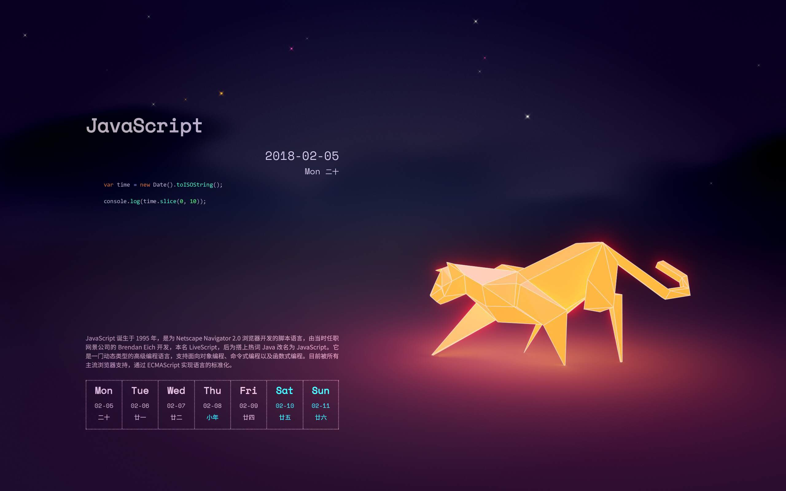

# 2018编程日历壁纸

Windows编程日历，效果如图

## 依赖程序

* [Python3](https://www.python.org)

安装Python并安装Wand库

`pip install wand`

* [ImageMagick](http://www.imagemagick.org)

最新版不支持[ImageMagick-6.9.9-34-Q8-x64-dll.exe](http://www.imagemagick.org/download/binaries/ImageMagick-6.9.9-34-Q8-x64-dll.exe)版本可用

> 注安装时需勾选`nstall development headers and libraries for C and C++`

安装文档见 http://docs.wand-py.org/en/latest/guide/install.html#install-imagemagick-on-windows

* [Ghostscript](https://www.ghostscript.com/)

## 使用

双击`wallpaper.bat`即可

可更换背景壁纸，替换`wallpaper.jpg`文件即可

将`wallpaper.bat`添加快捷方式到启动项即可实现自动更换

## 相关资源

编程日历pdf资源：http://www.ituring.com.cn/book/2625

V2EX：https://www.v2ex.com/t/427092

壁纸灵感及脚本参考：https://www.jianshu.com/p/912ce01d4752

原壁纸来自：Ubuntu 16.10 入选壁纸 Stalking\_Ocelot\_by\_Sayantan\_Chaudhuri

下载链接：https://www.iplaysoft.com/ubuntu-1610-wallpapers.html